# ビルドガイド

## 資料構成

1. [紹介](#%E7%B4%B9%E4%BB%8B)
    1. [キット付属パーツ](#%E3%82%AD%E3%83%83%E3%83%88%E4%BB%98%E5%B1%9E%E3%83%91%E3%83%BC%E3%83%84)
    1. [キット外のパーツ](#%E3%82%AD%E3%83%83%E3%83%88%E5%A4%96%E3%81%AE%E3%83%91%E3%83%BC%E3%83%84)
    1. [組み立てに必要な工具など](#%E7%B5%84%E3%81%BF%E7%AB%8B%E3%81%A6%E3%81%AB%E5%BF%85%E8%A6%81%E3%81%AA%E5%B7%A5%E5%85%B7%E3%81%AA%E3%81%A9)
1. [ハードウェア作業](#%E3%83%8F%E3%83%BC%E3%83%89%E3%82%A6%E3%82%A7%E3%82%A2%E4%BD%9C%E6%A5%AD)
    1. [はんだ付け](#%E3%81%AF%E3%82%93%E3%81%A0%E4%BB%98%E3%81%91-5)
    1. [ケースの工作](#%E3%82%B1%E3%83%BC%E3%82%B9%E3%81%AE%E5%B7%A5%E4%BD%9C)
    1. [組み立て](#%E7%B5%84%E3%81%BF%E7%AB%8B%E3%81%A6)
1. [ソフトウェア作業](#%E3%82%BD%E3%83%95%E3%83%88%E3%82%A6%E3%82%A7%E3%82%A2%E4%BD%9C%E6%A5%AD)
    1. [Pro Micro のファームウェアの書き込み](#pro-micro-%E3%81%AE%E3%83%95%E3%82%A1%E3%83%BC%E3%83%A0%E3%82%A6%E3%82%A7%E3%82%A2%E6%9B%B8%E3%81%8D%E8%BE%BC%E3%81%BF-by-remap)
1. [キーマップ設定作業](#%E3%82%AD%E3%83%BC%E3%83%9E%E3%83%83%E3%83%97%E8%A8%AD%E5%AE%9A%E4%BD%9C%E6%A5%AD)
    1. [キーマップの設定](#%E3%82%AD%E3%83%BC%E3%83%9E%E3%83%83%E3%83%97%E3%81%AE%E8%A8%AD%E5%AE%9A-by-remap)

 
 

<!------------ 紹介 ------------>

## 紹介

### キット付属パーツ

<!-- あああ
[x nn]は個数

* 筐体関連の大物
    * ケース(上)  [x 1]
    * ケース(下)  [x 1]

* 筐体関連の小物
    * スライドスイッチ  [x 1]
    * スライドスイッチ穴フィラー  [x 1]
    * 支柱(短-肉有)  [x 4]
    * 支柱(短-肉抜)  [x 4]
    * 支柱(長-肉有)  [x 6]
    * 支柱(長-肉抜)  [x 6]
    * ケース(上)用ポロンシート(2mm)  [x 10]
    * 支柱用ポロンシート(3mm)  [x 20]
    * ケース用プッシュリベット(長)  [x 6]
    * ケース用ゴム足  [x 4]

* 基板関連の大物
    * PCB  [x 1]
    * プレート  [x 1]
    * MX互換スイッチソケット  [x 46]
    * ダイオード (SMDタイプ)  [x 46]

* 基板関連の小物
    * ドーターボード  [x 1]
    * ドーターボード用プッシュリベット(短)  [x 4]
    * JST SH型 4ピンコネクタ付きジャンパワイヤ  [x 1]
    * Micro USB Type-B（2.0）端子  [x 1]
    * USB Type-C端子  [x 1]
    * 13pinピンソケット  [x 2]
    * 13pinピンヘッダー  [x 2]
    * スペーサー (3.5mm)  [x 5]
    * 低頭精密小ねじ (M2/3mm)  [x 5]
    * 小ねじ (M2)  [x 5]
-->

以下のパーツはキットに付属します。

パーツをなくしてしまった場合は補修パーツの購入ページを設けますので、  
購入ショップかTwitterでご連絡ください。

| 筐体部品 | 数量 | | 電子部品 | 数量 |
|  :-  |  -:  |-|  :-  |  -:  |
| ケース(上) | 1 | | PCB  | 1 |
| ケース(下) | 1 | | プレート  | 1 |
| スライドスイッチ  | 1 | | MX互換スイッチソケット  | 46 |
| スライドスイッチ穴フィラー  | 1 | | ダイオード (SMDタイプ)  | 46 |
| 支柱(短-肉有)   | 4 | | ドーターボード  | 1 |
| 支柱(短-肉抜)   | 4 | | JST SH型 4ピンコネクタ付きジャンパワイヤ  | 1 |
| 支柱(長-肉有)   | 6 | | Micro USB Type-B（2.0）端子  | 1 |
| 支柱(長-肉抜)   | 6 | | USB Type-C端子  | 1 |
| ケース(上)用ポロンシート(2mm)  | 10 | | 13pinピンソケット  | 2 |
| 支柱用ポロンシート(3mm)  | 20 | | 13pinピンヘッダー  | 2 |
| ケース用プッシュリベット(長)  | 6 | | RST用タクタイルスイッチ  | 1 |
| ドーターボード用プッシュリベット(短)  | 4 |
| ケース用ゴム足 | 4 |
| スペーサー (3.5mm)  | 5 |
| 低頭精密小ねじ (M2/3mm)  | 5 |
| 小ねじ (M2)  | 5 |

※ 付属品の外観ならびに型番は [パーツリスト(未完成)](../README_parts/README_jp.md) を参照してください

### キット外のパーツ

以下はキーボードの動作のために必須ですが、キットには含まれていません。  
自作キーボードを扱うショップよりご購入ください。

| 品目 | 数量 |
|  :-  |  -:  |
| Pro Micro  | 1 |
| MX互換スイッチ  | 46 |
| キーキャップ  | - |
| 2U スタビライザー  | 3 または 2※ |
| USBケーブル (USB Type-C)  | 1 |

※ スタビライザーは左Shiftを分割する場合 2つ で足ります

### 組み立てに必要な工具など

組み立て時に必須の工具とあったほうがよい工具(推奨)は以下のとおりです。

| 必須         | 数量 | | 推奨                 | 数量 |
|  :-          |  -:  |-|  :-                  |  -:  |
| パソコン     | 1    | | 作業マット (A4以上)  | 1 |
| ドライバー   | -    | | 逆作用ピンセット     | 1 |
| ニッパー     | 1    | | エポキシ接着剤       | 1 |
| はんだごて   | 1    | | 木工用ボンド         | 1 |
| はんだごて台 | 1 |
| はんだ       | - |
| マスキングテープ  | 1 |

 
 

<!------------ ハードウェア ------------>

## ハードウェア作業

### Pro Micro の破損対策 (オプション)

Pro Micro は USBケーブルの抜き差し中にマイコンボード側のコネクタの破損がまれによくあるそうなので、
コネクタを補強します。  
最初の作業がオプションとなりますが、完了までにかかる時間のほとんどが放置時間ですので、先に済ませます。

1. エポキシ接着剤 で Pro Micro のUSBコネクタの周囲を補強する

    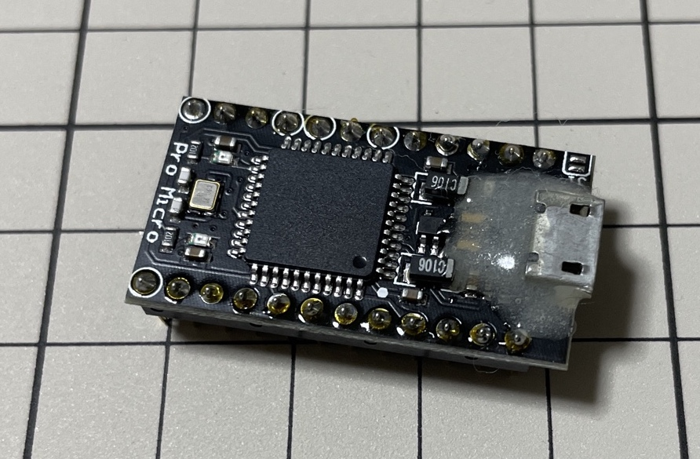

1. 放置し、次の作業をすすめる

 

### はんだ付け (/5)

大変な作業から順に並べています。
2つ目が終わるとほぼ終わっています。  
<!--作者向けに作業を配信してくださると、作者が作業動画としてありがたがり、新作が進捗します。-->

#### ダイオード (SMDタイプ) のはんだ付け (1/5)

1. 1つ目の ダイオード (SMDタイプ) を基板にはんだ付けする
    * **注意事項** D91とD92 は ダイオード (SMDタイプ) の取り付け対象外

        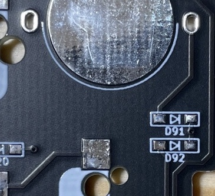

    1. 部品を載せる前に、2つある■( `[■ ▷| ■]` )の片側に予備はんだを盛る  
       ※ はんだごてを持つ手側の■に盛るとよいです  

       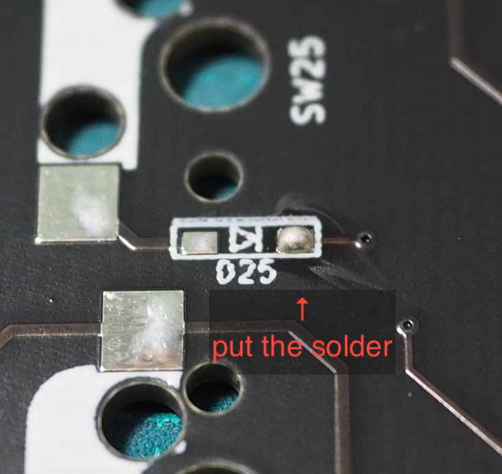
    1. ダイオード (SMDタイプ) の片足を予備はんだと接合する  
       ※ ダイオードに印字されている `|` と`[■ ▷| ■]` の `▷|` を合わせてください  

       
    1. ダイオード (SMDタイプ) が基板から浮いていないことを確認する  

       
    1. ダイオード (SMDタイプ) の未接合の足をはんだ付けする

       
    1. ダイオード (SMDタイプ) が基板から浮いていないことを確認する

1. 残る45個の ダイオード (SMDタイプ) を基板にはんだ付けする
    1. 部品を載せる前に、2つあるスペースの片側に予備はんだを盛る
    1. ダイオード (SMDタイプ) の片足を予備はんだと接合する
    1. ダイオード (SMDタイプ) が基板から浮いていないことを確認する
    1. ダイオード (SMDタイプ) の未接合の足をはんだ付けする
    1. ダイオード (SMDタイプ) が基板から浮いていないことを確認する

#### MX互換スイッチソケット のはんだ付け (2/5)

手前の MX互換スイッチソケット は、キー幅変更の都合でほぼ同じ位置の上下2箇所にMX互換スイッチソケット を装着可能としています。  
意図しない箇所に MX互換スイッチソケット を装着すると、修正の手数が増え、かつ部品が不足します。  
キー幅と装着箇所は以下のように複雑になってしまっているため、先に装着箇所を決定し、マークしてください。

<!--

                                                    -->

1. 1つ目の MX互換スイッチソケット を基板にはんだ付けする
    1. 部品を載せる前に、2つあるスペースの片側に予備はんだを盛る

       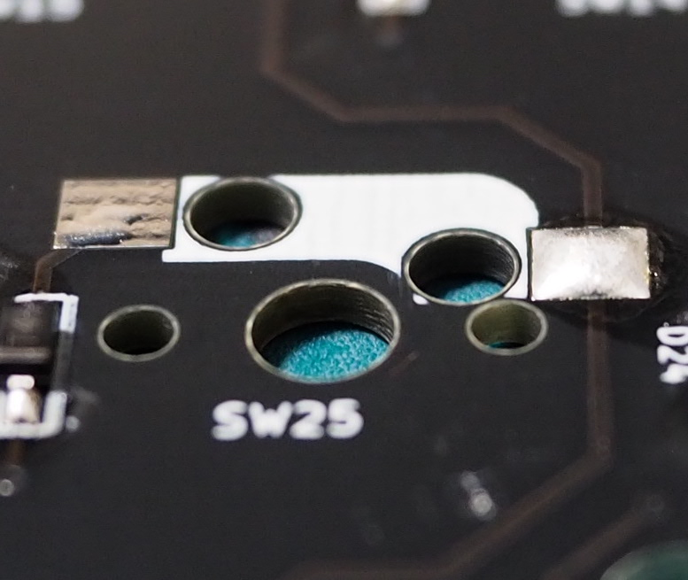
    1. MX互換スイッチソケット の片足を予備はんだと接合する

       
    1. MX互換スイッチソケット が基板から浮いていないことを確認する

       
    1. MX互換スイッチソケット の未接合の足をはんだ付けする

       
    1. MX互換スイッチソケット が基板から浮いていないことを確認する

1. 残る45個の MX互換スイッチソケット を基板にはんだ付けする
    1. 部品を載せる前に、2つあるスペースの片側に予備はんだを盛る
    1. MX互換スイッチソケット の片足を予備はんだと接合する
    1. MX互換スイッチソケット が基板から浮いていないことを確認する
    1. MX互換スイッチソケット の未接合の足をはんだ付けする
    1. MX互換スイッチソケット が基板から浮いていないことを確認する

#### 13pinピンソケット と 13pinピンヘッダー のはんだ付け (3/5)

1. 下準備
    1. 13pinピンソケット を PCB にのせる x2  
       ※ 13pinピンソケット をのせる面は ダイオード と同じです

       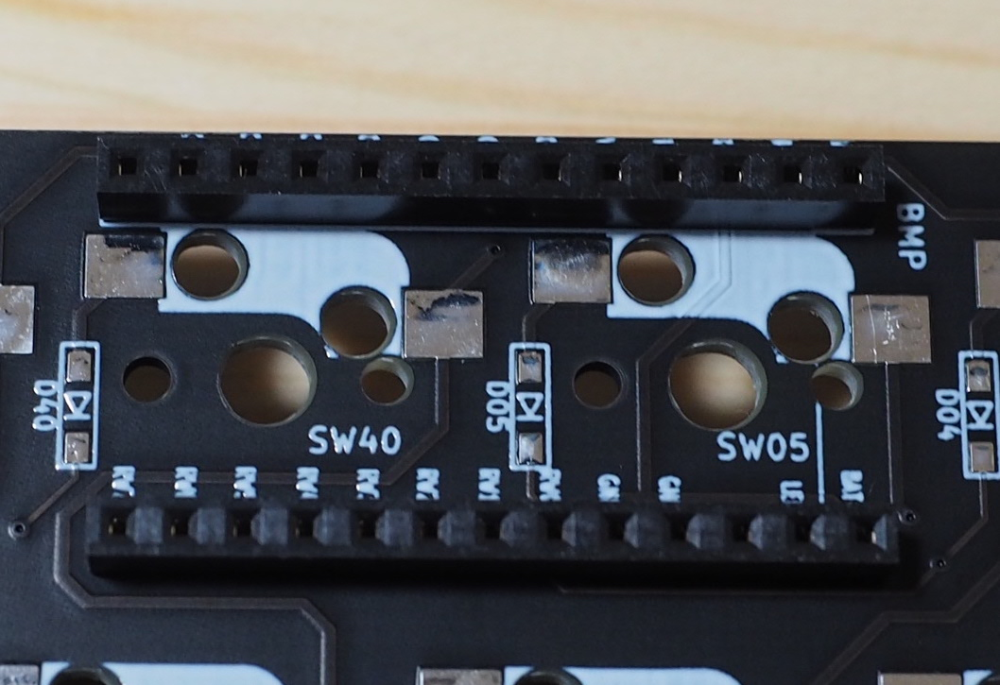
    1. 13pinピンヘッダー を1pin分カットし、12pinにする x2  
       ※ Pro Micro の代わりに BLE Micro Pro を使用する場合はカットせずに 13pin のままはんだ付けしてください

       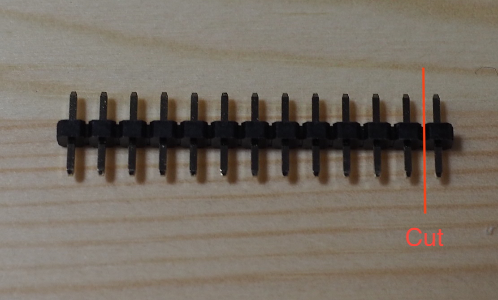
    1. 13pinピンヘッダー を 13pinピンソケット に差し込む x2  
       ※ 画像は隙間がありますが、次の Pro Micro をのせたあとにぎゅっと押して隙間をなくします  
       ※ Pro Micro の場合、さきほど 1pin 切り取ったとおり 13pinピンソケット と 13pinピンヘッダー の数が一致していない状態が正常となります

       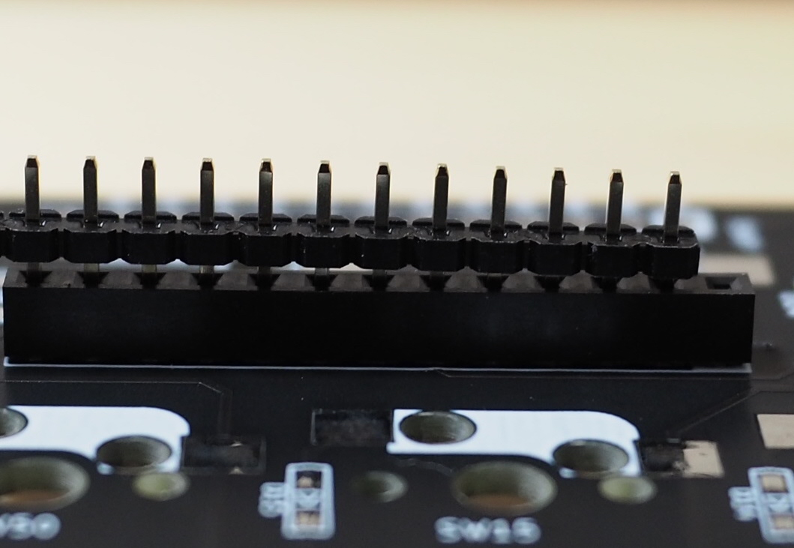
    1. Pro Micro を 13pinピンヘッダー にのせる

       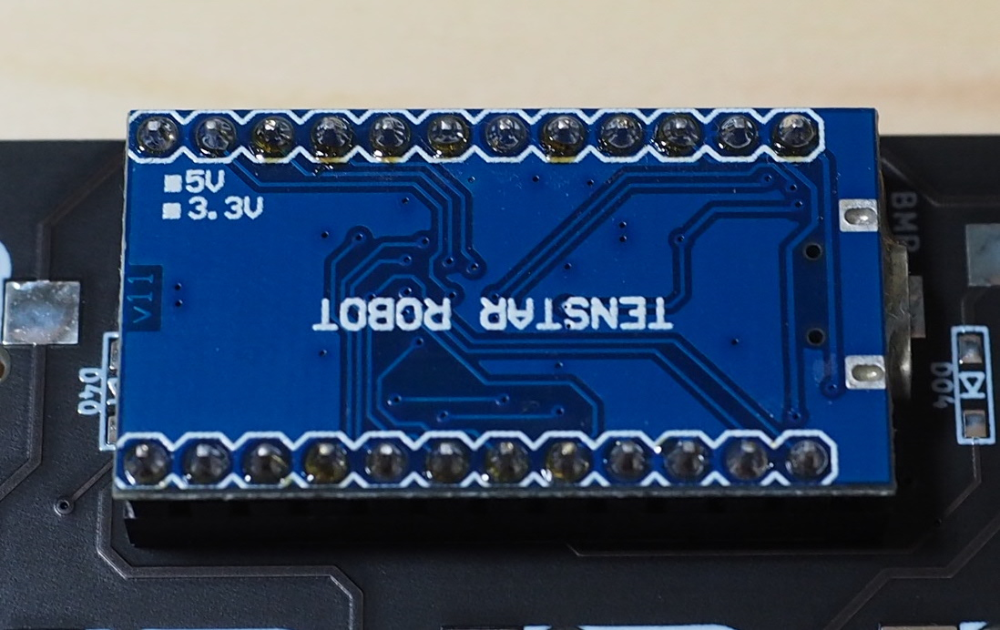
    1. マスキングテープで上記を固定する

       

1. 1本目の 13pinピンソケット を PCB にはんだ付けする
    1. 13pinピンソケット の端の1pinをはんだ付けする

       
    1. 13pinピンソケット が PCB から浮いていないことを確認する
    1. 13pinピンソケット の反対端の1pinをはんだ付けする

       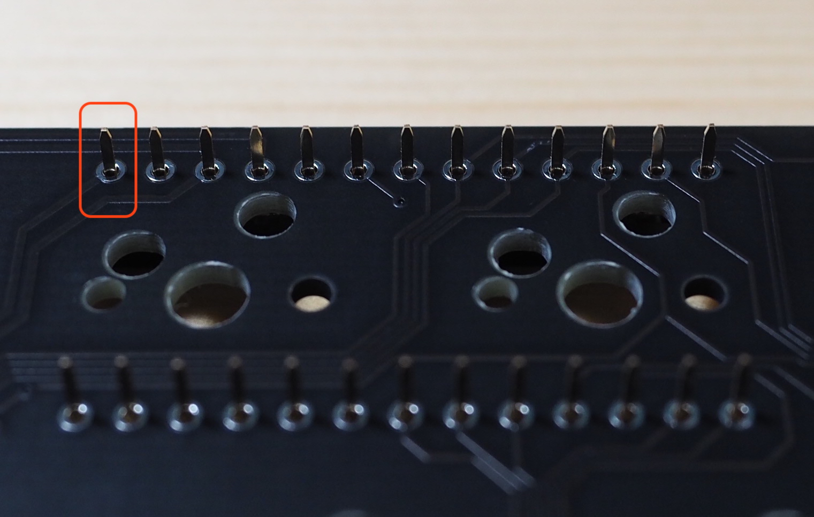
    1. 13pinピンソケット が PCB から浮いていないことを確認する
    1. 13pinピンソケット の残りのpinをはんだ付けする

1. 2本目の 13pinピンソケット を PCB にはんだ付けする
    1. 13pinピンソケット の端の1pinをはんだ付けする
    1. 13pinピンソケット が基板から浮いていないことを確認する
    1. 13pinピンソケット の反対端の1pinをはんだ付けする
    1. 13pinピンソケット が基板から浮いていないことを確認する
    1. 13pinピンソケット の残りのpinをはんだ付けする

   ※ここまでマスキングテープを剥がす必要はないはずです

1. 1本目の 13pinピンヘッダー を Pro Micro にはんだ付けする
    1. 13pinピンヘッダー の端の1pinをはんだ付けする
    1. 13pinピンヘッダー が Pro Micro から浮いていないことを確認する
    1. 13pinピンヘッダー の反対端の1pinをはんだ付けする
    1. 13pinピンヘッダー が Pro Micro から浮いていないことを確認する

1. 2本目の 13pinピンヘッダー を Pro Micro にはんだ付けする
    1. 13pinピンヘッダー の端の1pinをはんだ付けする
    1. 13pinピンヘッダー が Pro Micro から浮いていないことを確認する
    1. 13pinピンヘッダー の反対端の1pinをはんだ付けする
    1. 13pinピンヘッダー が Pro Micro から浮いていないことを確認する

1. マスキングテープを剥がす

1. 2本の 13pinピンヘッダー を Pro Micro にはんだ付けする
    1. 13pinピンヘッダー の残りのpinをはんだ付けする

1. 2本の 13pinピンソケット の PCB から余分に伸びている足をカットする

    
 1. 2本の 13pinピンヘッダー の Pro Micro から余分に伸びている足をカットする

    

#### RST用タクタイルスイッチ のはんだ付け (4/5)

1. RST用タクタイルスイッチ を PCB にはんだ付けする
    1. RST用タクタイルスイッチ を PCB に取り付ける  
       ※ RST用タクタイルスイッチ を取り付ける面は ダイオード と同じです

        
    1. RST用タクタイルスイッチ が PCB から浮いていないことを確認する
    1. RST用タクタイルスイッチ をはんだ付けする

#### ワイヤー のはんだ付け (5/5)

(キーボードの利用シーンを仮にPCとしています)  
PCとキーボードの接続にて、PC と キーボードの Pro Micro をUSBケーブルで直接接続するわけではありません。  
`[PC]--[USB Type-Cケーブル]--[ドーターボード]--[JST SH型 4ピンコネクタ付きジャンパワイヤ]--[Pro Micro]` という物理的な接続となります (以下は取り出した写真) 。

このとき、[Pro Micro]と接続する[JST SH型 4ピンコネクタ付きジャンパワイヤ]にUSBオスコネクタが取り付けられていませんので、  
使用する Pro Micro に合わせたコネクタ と USBオスコネクタ をはんだ付けします。

1. Micro USB Type-B（2.0）端子 と JST SH型 4ピンコネクタ付きジャンパワイヤ をはんだ付けする場合
    1. Micro USB Type-B（2.0）端子 の端子に予備はんだを盛る

        
    1. 画像のとおりにはんだ付けする

        

        
1. USB Type-C端子 と JST SH型 4ピンコネクタ付きジャンパワイヤ をはんだ付けする場合
    1. USB Type-C端子 の端子に予備はんだを盛る
    1. 画像のとおりにはんだ付けする

          

        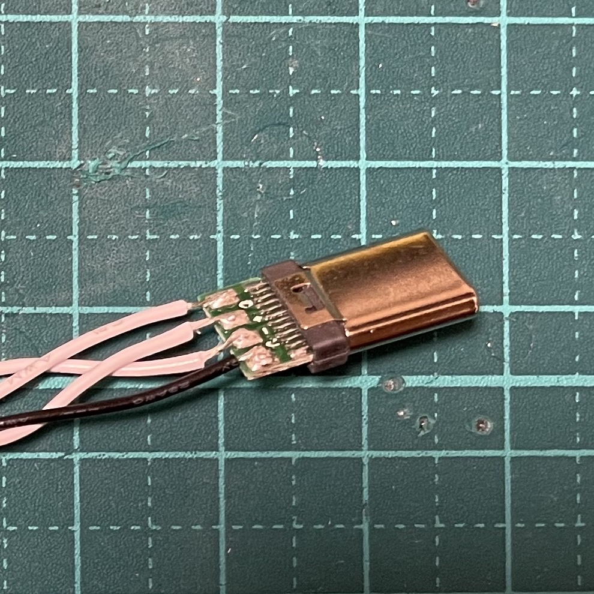

なお、はんだ付けのために剥いたワイヤーの芯線同士が接触しないように エポキシ接着剤 などで固定しておくとよいです。

#### 番外：BMP用電源パーツ のはんだ付け (別資料)

Pro Micro の代わりに BLE Micro Pro を使用する場合は [BMP](../README_bmp/README_jp.md#%E3%81%AF%E3%82%93%E3%81%A0%E4%BB%98%E3%81%91-4) を参照してください。

 

### ケースの工作

#### ケース(上)用ポロンシート(2mm) と 支柱用ポロンシート(3mm) の貼り付け

1. ケース(上) に ケース(上)用ポロンシート(2mm) を貼り付ける
    1. ケース(上) の10箇所のくぼみに ケース(上)用ポロンシート(2mm) を貼り付ける  
       ※ ケース(上)用ポロンシート(2mm) は 10本入っているポロンシートです

1. 支柱に 支柱用ポロンシート(3mm) を貼り付ける
    1. 使用する支柱を選ぶ
        * ケース(下) の10箇所のくぼみについて  
          肉抜きのない支柱と肉抜きのある支柱の計20本 (短4本x2+長6本x2) の取り付け位置を決める  

          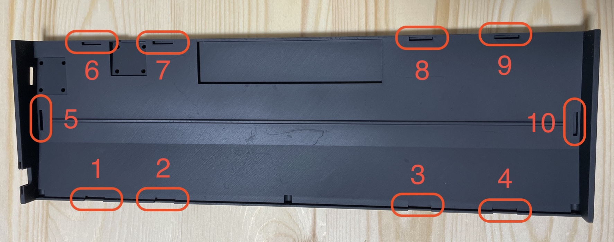
        * 参考取り付け位置
            * 1,2,3,4: 支柱(短-肉有) + 5,6,7,8,9,10: 支柱(長-肉有)
            * 1,4: 支柱(短-肉抜) + 2,3: 支柱(短-肉有) + 5,6,9,10: 支柱(長-肉抜) + 7,8: 支柱(長-肉有)
            * 2,3: 支柱(短-肉抜) + 5,6,9,10: 支柱(長-肉抜)

              肉抜きの支柱は押し込まれたときにちょっとたわむため、肉抜きの意味が多少あると言われています
    1. 使用する支柱に 支柱用ポロンシート(3mm) を貼り付ける  
       ※ 支柱用ポロンシート(3mm) は 20本入っているポロンシートです  
       ※ 支柱は取り付け向きがあり、フィレットがかかっている面を中心に向けます  
       ※ 支柱の取り付け位置は支柱(短)が1-4、支柱(長)が5-10となります

#### 支柱 の取り付け

1. ケース(下) に支柱を取り付ける
    1. ポロンシートを貼り付けた支柱をそれぞれの位置に取り付ける  
       ※ 木工用ボンドで固定するのがおすすめです (取替時にカスを除去しやすい)

 

### 組み立て

1. 2U スタビライザー を取り付ける

1. PCB に 小ねじ (M2) と スペーサー (3.5mm) を取り付ける  
   ※ 小ねじ (M2) は頭が丸いネジです

    
1. PCB と プレート を 低頭精密小ねじ (M2/3mm) で合体する  
   ※ 低頭精密小ねじ (M2/3mm) は頭が平たいネジで、完成後に目立ちにくくなります

    
1. MX互換スイッチ を プレート に取り付ける  
   ※ PCB を裏から抑えながらスイッチを取り付けると、はんだづけ箇所の破損を防ぐ効果があります  
   ※ スイッチの前後向きや、左右位置に気をつけてください

1. Pro Micro を PCB に取り付ける  
   ※ Pro Micro を使う場合は `BAT-` や `BAT+` のpinを空けて取り付けてください

    
1. ドーターボード を ドーターボード用プッシュリベット(短) で ケース(下) に取り付ける  
   ※ ドーターボード用プッシュリベット(短) は少し短い4本入りのものです

    
1. JST SH型 4ピンコネクタ付きジャンパワイヤ を接続する (ケース(下) と PCBの合体)

    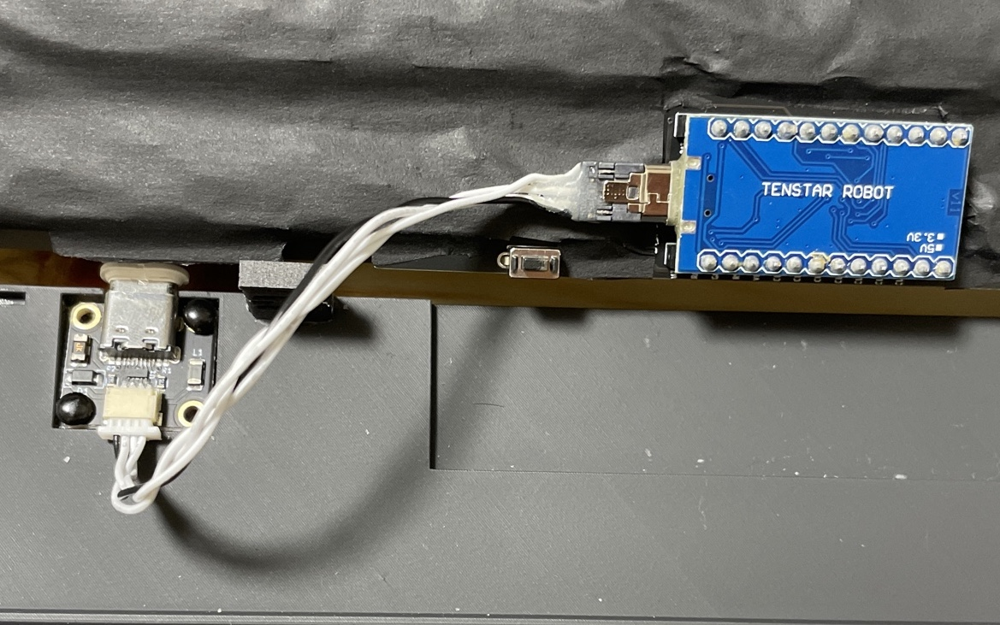
1. スライドスイッチ穴フィラー を ケース(下) に取り付ける  
   ※ BLE Micro Pro を使用する場合は スライドスイッチ となります

1. ケース(下) と ケース(上) を ケース用プッシュリベット(長) で合体する (終)  
   ※ ケース用プッシュリベット(長) は少し長い6本入りのものです

    

### ハードウェア作業の終わり

以上で見た目がキーボードとなりました。  
キーボードとして使うためには Pro Micro に適切なファームウェアが書き込まれている必要があります。  
次のソフトウェアの作業を実施してください。

 
 

<!------------ ソフトウェア ------------>

## ソフトウェア作業

### Pro Micro のファームウェア書き込み (by Remap)

※Pro Micro の代わりに BLE Micro Pro を使用する場合は [BMP](../README_bmp/README_jp.md#%E3%82%BD%E3%83%95%E3%83%88%E3%82%A6%E3%82%A7%E3%82%A2%E4%BD%9C%E6%A5%AD) を参照してください。

1. ケースに Pro Micro を納めている場合は取り出し、 JST SH型 4ピンコネクタ付きジャンパワイヤ を外す
1. PCB に Pro Micro を取り付けたまま USBケーブル でPCに接続する
1. Remapにて、ファームウェアファイルを Pro Micro に書き込む
    1. [こちら](https://remap-keys.app/catalog/3rpQkcurHny6IPkoYaSW/firmware)に Google Chrome でアクセスるす
    1. [FLASH] を押下する

        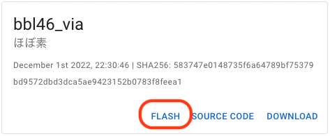
    1. [Bootloader] に [caterina] を選択し、もう一度[FLASH]を押下する

        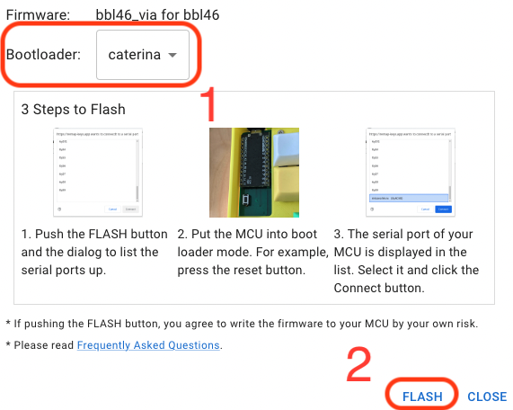
    1. 「remap-keys.app がシリアルポートへの接続を要求しています」と表示されたら、PCB の RST用タクタイルスイッチ を押す

        
    1. Pro Micro のLEBが赤く点灯したら、即座に[Arduino Micro]を選択し、即座に[接続]を押下する

        
    1. 進捗が100%となり、「Writing the firmware finished successfully.」と表示されたら[CLOSE]を押下する

        
1. ケースに PCB を納めて組み立てなおす

### ソフトウェア作業の終わり

以上で Pro Micro にファームウェアが書き込まれ、すでにキーボードとして認識された反応が PC で発生したものと思います。  
現在のキーボードでは以下のように数字を入力できないなど不便な状態となっています。

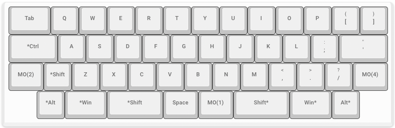

次のキーマップ設定作業を実施してください。

 
 

<!------------ キーマップ ------------>

## キーマップ設定作業

### キーマップの設定 (by Remap)

1. Remapにて、キーマップ設定を変更する
    1. [こちら](https://remap-keys.app)に Google Chrome でアクセスする

    1. [START REMAP FOR YOUR KEYBOARD] を押下する

        
    1. [+KEYBOARD] を押下する

        
    1. 「remap-keys.app が HID デバイスへの接続を要求しています」と表示されたら[bbl46] を選択し、[接続]を押下する  
       ※ Pro Micro の場合は「 bbl46 」を、BLE Micro Pro の場合は「 (BMP)bbl46 」を選択してください

        
    1. お好みのキーマップを作成し、 [flash] を押下する

        

### キーマップの設定終わり

以上でキーマップ設定が終わり、キーボードとして完成しました。  
お疲れ様でした。

 
 

# さいごに

自作キーボードのHW/SW設計構築の普及を進めてくださっている先人に感謝申し上げます。  
また、 bbl46 に興味を持ってくださいまして、ありがとうございます。
