# パーツ

## 筐体部品

### ケース(上)

型番: なし

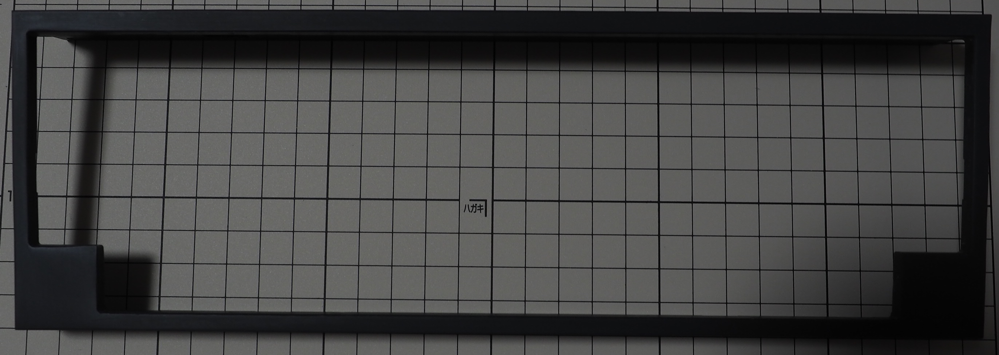

### ケース(下)

型番: なし

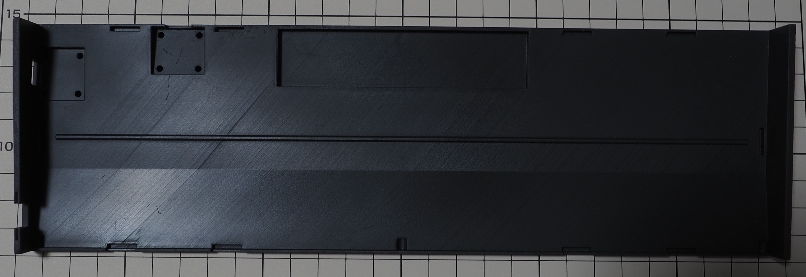

### スライドスイッチ

型番: なし

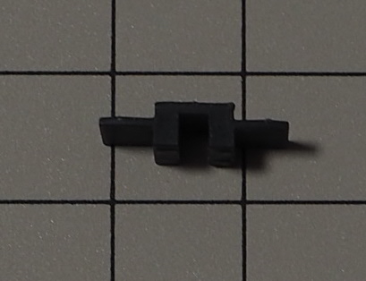

### スライドスイッチ穴フィラー

型番: なし

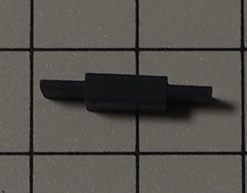

### 支柱(短-肉有)

型番: なし

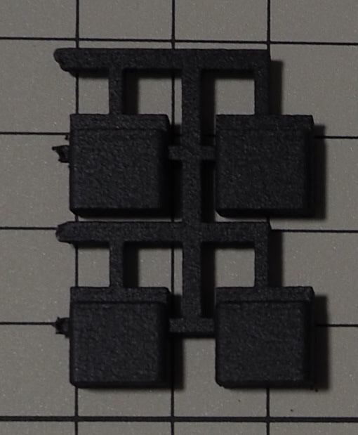

### 支柱(短-肉抜)

型番: なし

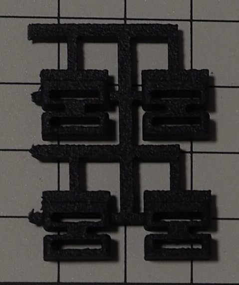

### 支柱(長-肉有)

型番: なし

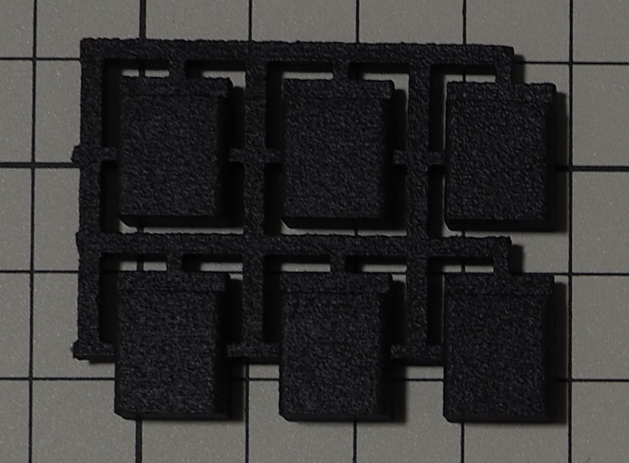

### 支柱(長-肉抜)

型番: なし

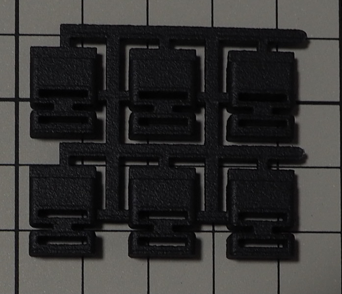

### ケース(上)用ポロンシート(2mm)

型番: L32-1.550MT (2mmx10mmカット)

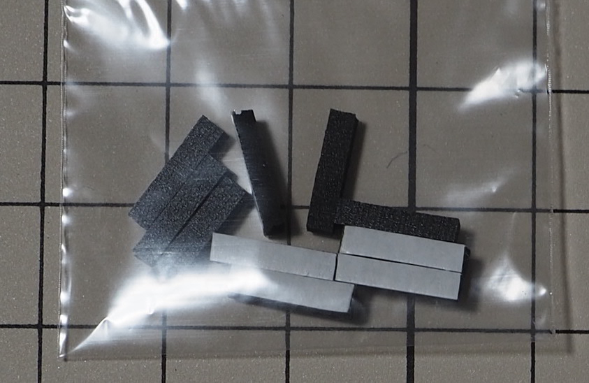

### 支柱用ポロンシート(3mm)

型番: L32-1.550MT (3mmx10mmカット)

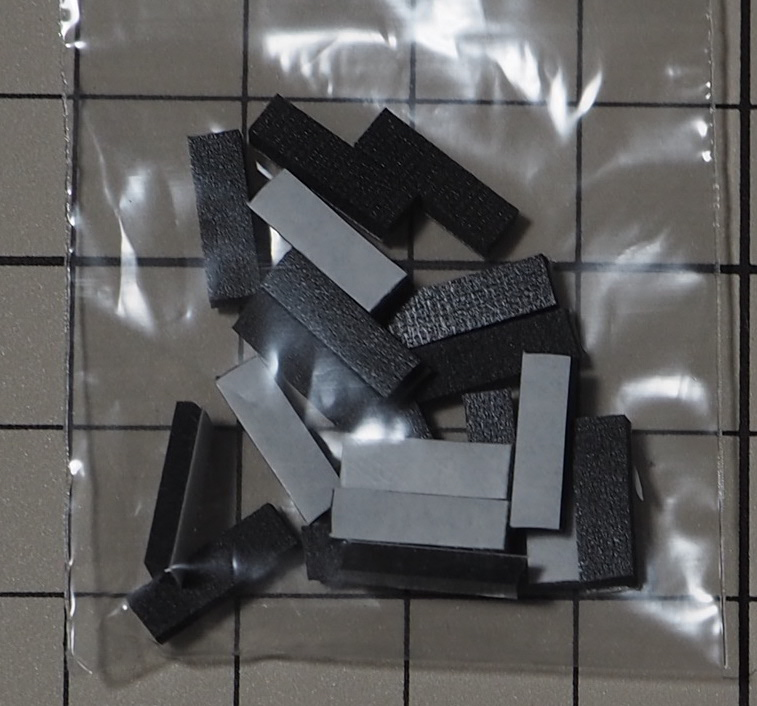

### ケース用プッシュリベット(長)

型番: a19032500ux0034jp  
ASIN: B07S5H8VPS

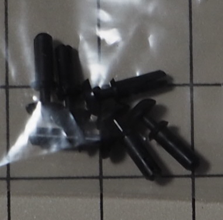

### ドーターボード用プッシュリベット(短)

型番: 不明  
ASIN: B071KNKNM5

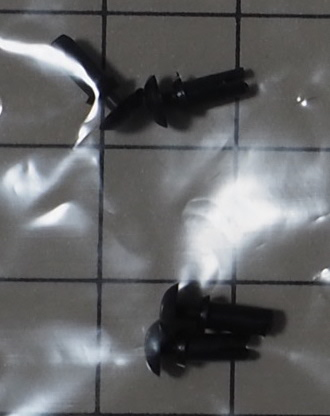

### ケース用ゴム足

型番: CS-01  
ASIN: B00V5MQQ5A

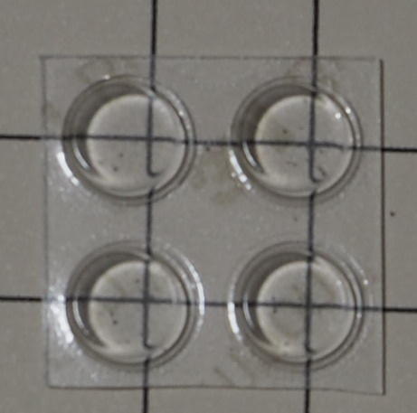

### スペーサー (3.5mm) + 小ねじ (M2)

型番: 不明  
品名: KBDFANS M2-3 COUNTERSUNK FLAT HEAD SCREW KIT

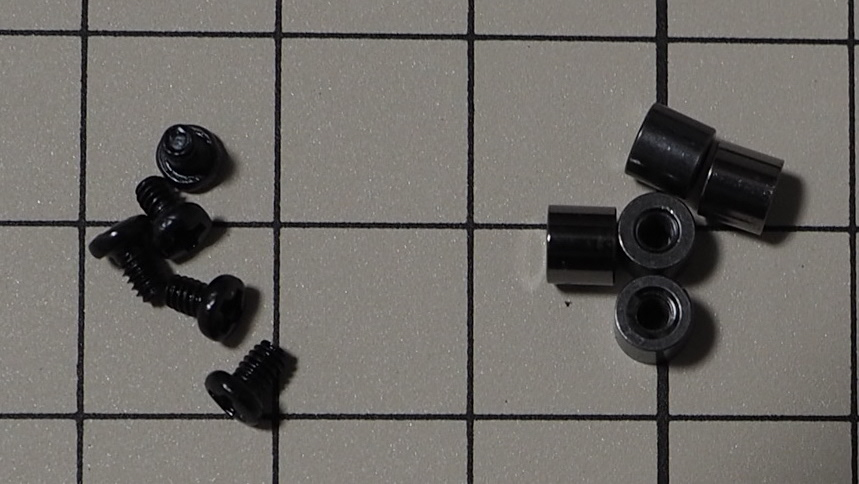

### 低頭精密小ねじ (M2/3mm)

型番: FX-0230EB

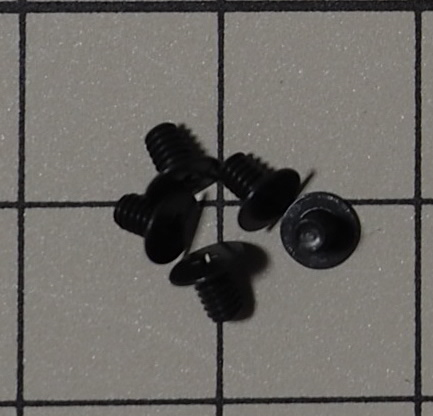

 

## 電子部品

### PCB

型番: なし

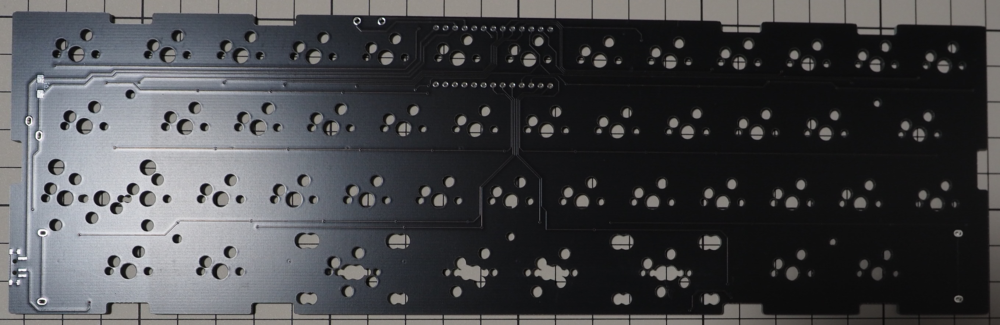

### プレート

型番: なし

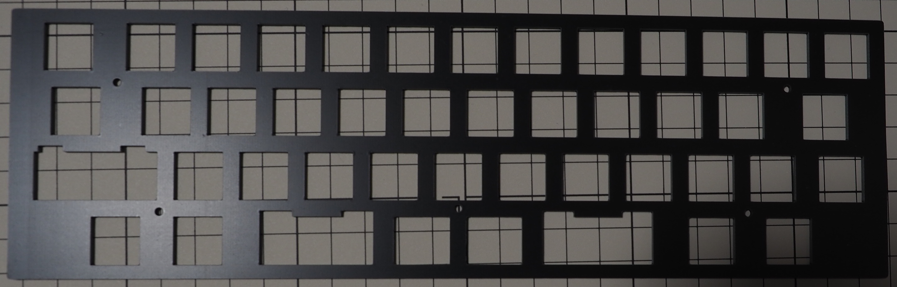

### MX互換スイッチソケット

型番: CPG151101S11

### ダイオード (SMDタイプ)

型番: 1N4148

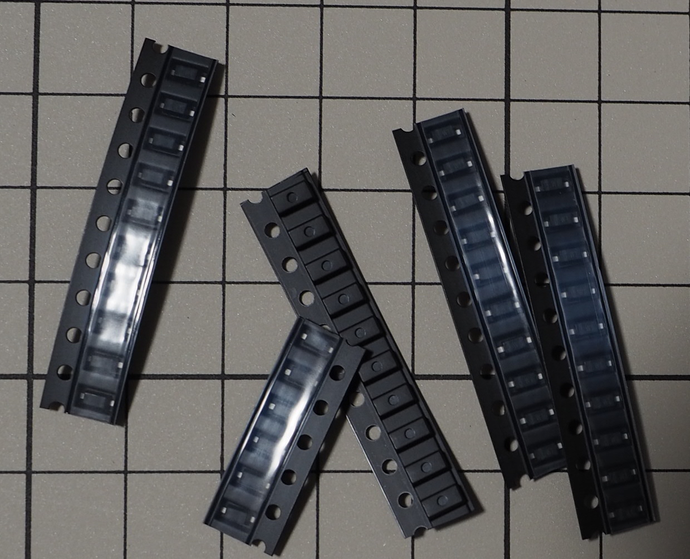

### ドーターボード

型番: なし  
品名: Unified Daughterboard C3

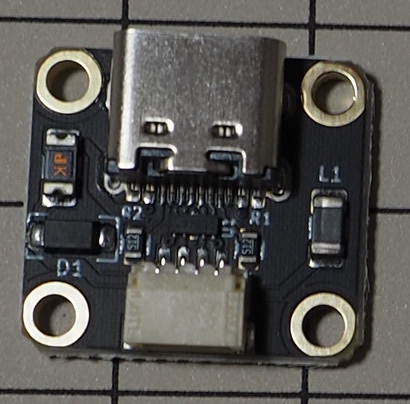

### JST SH型 4ピンコネクタ付きジャンパワイヤ

型番: AF-EMGSH4F010

### Micro USB Type-B（2.0）端子

型番: 不明  
ASIN: B07JGYSFYP

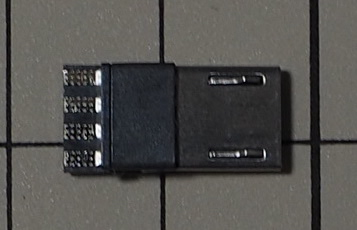

### USB Type-C端子

型番: 不明  
ASIN: B0B3HSXR9F

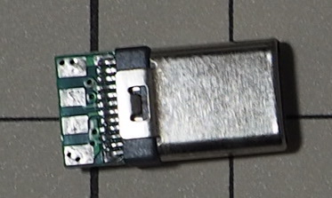

### 13pinピンソケット

型番: HSCSW-S13G-H3.5-L5.6

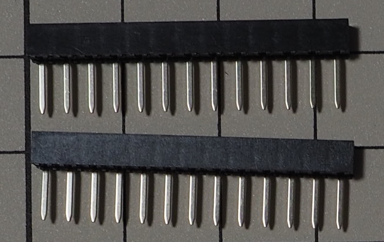

### 13pinピンヘッダー

型番: 不明  
商品コード: SSCI-039406

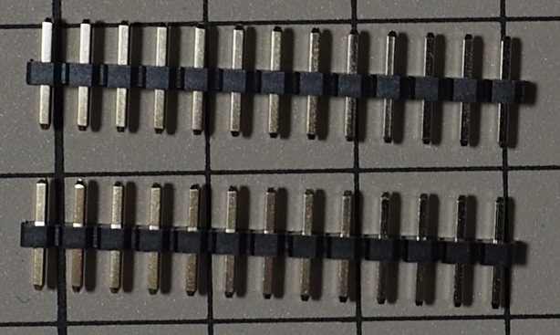

### RST用タクタイルスイッチ

型番: TS-1136-4.3

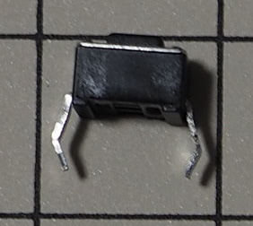

