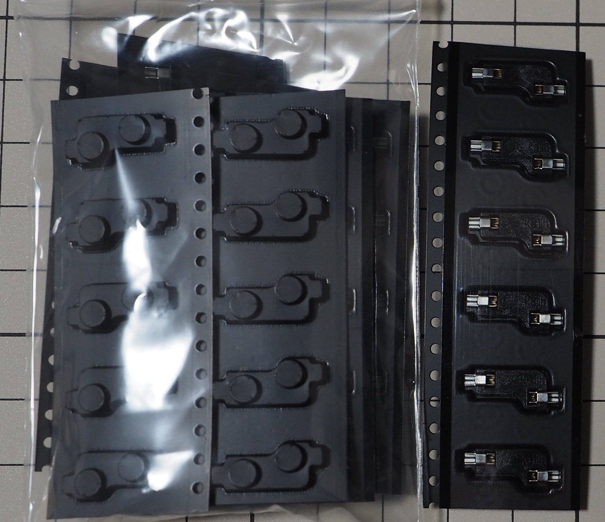

# パーツ

## 筐体部品

### ケース(上)

型番: なし

### ケース(下)

型番: なし

### スライドスイッチ

型番: なし

### スライドスイッチ穴フィラー

型番: なし

### 支柱(短-肉有)

型番: なし

### 支柱(短-肉抜)

型番: なし

### 支柱(長-肉有)

型番: なし

### 支柱(長-肉抜)

型番: なし

### ケース(上)用ポロンシート(2mm)

型番: L32-1.550MT (2mmx10mmカット)

### 支柱用ポロンシート(3mm)

型番: L32-1.550MT (3mmx10mmカット)

### ケース用プッシュリベット(長)

型番: a19032500ux0034jp  
ASIN: B07S5H8VPS

### ドーターボード用プッシュリベット(短)

型番: 不明  
ASIN: B071KNKNM5

### ケース用ゴム足

型番: CS-01  
ASIN: B00V5MQQ5A

### スペーサー (3.5mm) + 小ねじ (M2)

型番: 不明  
品名: KBDFANS M2-3 COUNTERSUNK FLAT HEAD SCREW KIT

### 低頭精密小ねじ (M2/3mm)

型番: FX-0230EB

 

## 電子部品

### PCB

型番: なし

### プレート

型番: なし

### MX互換スイッチソケット

型番: CPG151101S11

### ダイオード (SMDタイプ)

型番: 1N4148

### ドーターボード

型番: なし  
品名: Unified Daughterboard C3

### JST SH型 4ピンコネクタ付きジャンパワイヤ

型番: AF-EMGSH4F010

### Micro USB Type-B（2.0）端子

型番: 不明  
ASIN: B07JGYSFYP

### USB Type-C端子

型番: 不明  
ASIN: B0B3HSXR9F

### 13pinピンソケット

型番: HSCSW-S13G-H3.5-L5.6

### 13pinピンヘッダー

型番: 不明  
商品コード: SSCI-039406

### RST用タクタイルスイッチ

型番: TS-1136-4.3

