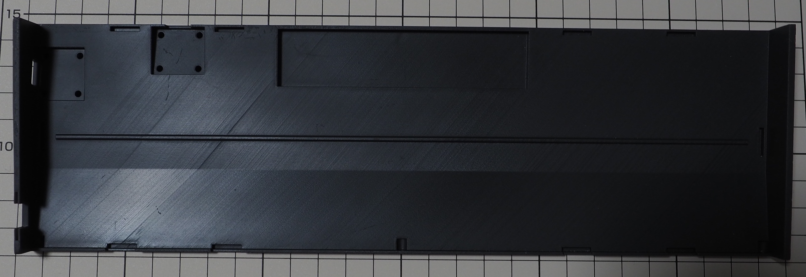
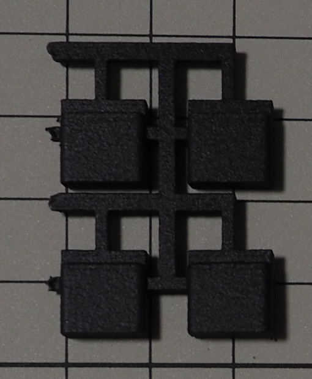
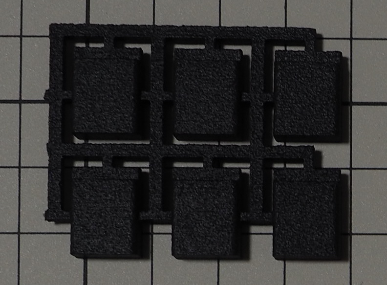
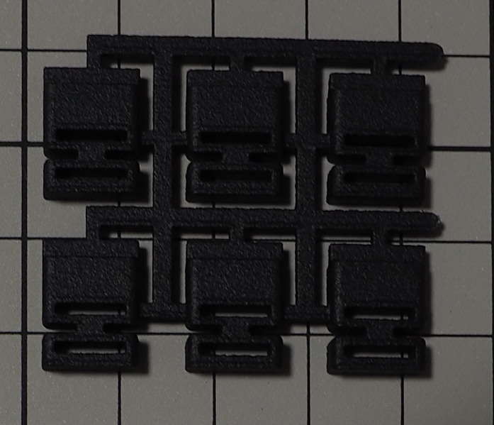
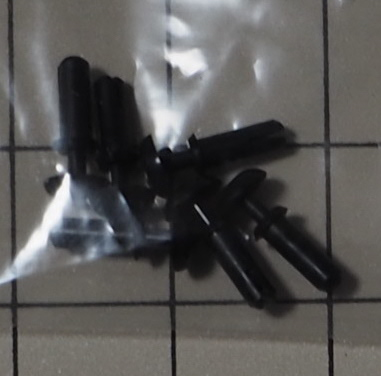
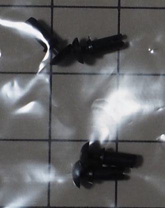
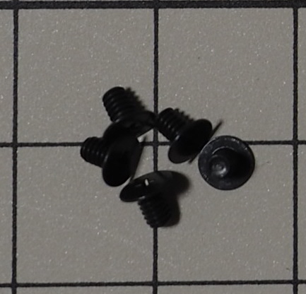
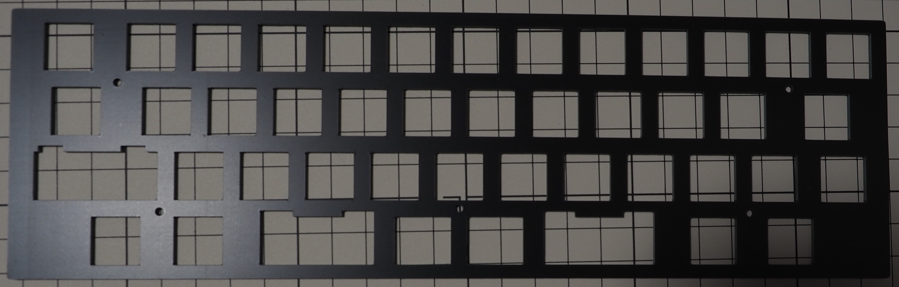
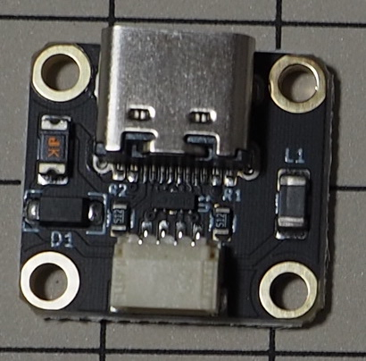

# パーツ

## 筐体部品

### $caseu_nn

型番: なし

### $cased_nn

型番: なし

### $ssw1_nn

型番: なし

### $ssw2_nn

型番: なし

### $ps1_nn

型番: なし

### $ps2_nn

型番: なし

### $pl1_nn

型番: なし

### $pl2_nn

型番: なし

### $poronu_nn

型番: L32-1.550MT (2mmx10mmカット)

### $porond_nn

型番: L32-1.550MT (3mmx10mmカット)

### $case_rivet_nn

型番: a19032500ux0034jp  
ASIN: B07S5H8VPS

### $daughter_board_rivet_nn

型番: 不明  
ASIN: B071KNKNM5

### $rubber_foot_nn

型番: CS-102  
ASIN: B00V5MQQ5A

### $spacer_nn + $scr_smallb_nn

型番: 不明  
品名: KBDFANS M2-3 COUNTERSUNK FLAT HEAD SCREW KIT

### $scr_smallf_nn

型番: FX-0230EB

 

## 電子部品

### $pcb_nn

型番: なし

### $plate_nn

型番: なし

### $sw_socket_nn

型番: CPG151101S11

### $diode_nn

型番: 1N4148

### $daughter_board_nn

型番: なし  
品名: Unified Daughterboard C3

### $jst_wire_nn

型番: AF-EMGSH4F010

### $usb_b_con_nn

型番: 不明  
ASIN: B07JGYSFYP

### $usb_c_con_nn

型番: 不明  
ASIN: B0B3HSXR9F

### $pin_socket_nn

型番: HSCSW-S13G-H3.5-L5.6

### $pin_header_nn

型番: 不明  
商品コード: SSCI-039406

### $reset_sw_nn

型番: TS-1136-4.3

