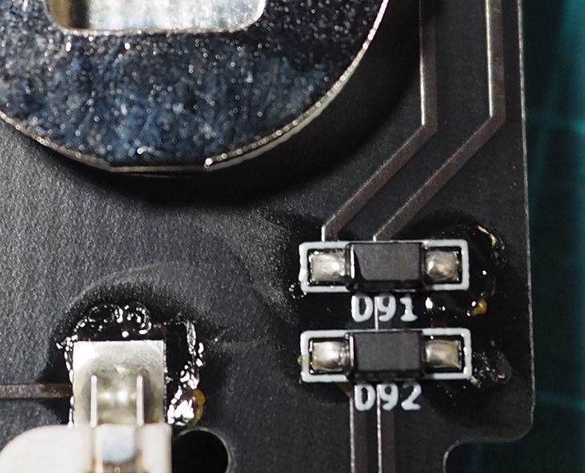
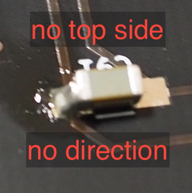
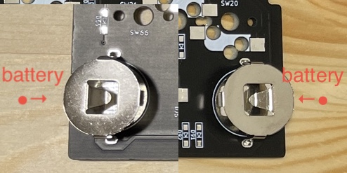
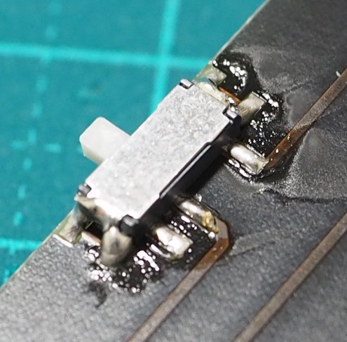

# BMP対応

## 資料構成

1. [紹介](#%E7%B4%B9%E4%BB%8B)
    1. [BMPに必要なパーツ](#bmp%E3%81%AB%E5%BF%85%E8%A6%81%E3%81%AA%E3%83%91%E3%83%BC%E3%83%84)
1. [ハードウェア作業](#%E3%83%8F%E3%83%BC%E3%83%89%E3%82%A6%E3%82%A7%E3%82%A2%E4%BD%9C%E6%A5%AD)
    1. [はんだ付け](#%E3%81%AF%E3%82%93%E3%81%A0%E4%BB%98%E3%81%91-5)
1. [ソフトウェア作業](#%E3%82%BD%E3%83%95%E3%83%88%E3%82%A6%E3%82%A7%E3%82%A2%E4%BD%9C%E6%A5%AD)
    1. [BLE Micro Pro のファームウェアの書き込み](#%E3%82%BD%E3%83%95%E3%83%88%E3%82%A6%E3%82%A7%E3%82%A2%E4%BD%9C%E6%A5%AD)

 
 

<!------------ 紹介 ------------>

## 紹介

### BMPに必要なパーツ

BMPを使う場合のパーツはキットに付属しませんので、別途ご購入ください。

| 部品 | 数量 |
|  :-  |  -:  |
| [BLE Micro Pro](https://shop.yushakobo.jp/products/ble-micro-pro) | 1 |
| [電池部品セット](https://shop.yushakobo.jp/products/5623) | 1 |
| コイン電池 CR1632  | 2 |

 
 

<!------------ ハードウェア ------------>

## ハードウェア作業

### はんだ付け (/4)

#### ショットキーバリアダイオード のはんだ付け (1/4)

1. ショットキーバリアダイオード を PCB にはんだ付けする
    * 取り付け位置は D91とD92

    1. 部品を載せる前に、2つある■( `[■ ▷| ■]` )の片側に予備はんだを盛る  
       ※ はんだごてを持つ手側の■に盛るとよいです  
    1. ショットキーバリアダイオード の片足を予備はんだと接合する  
       ※ ダイオードに印字されている `|` と`[■ ▷| ■]` の `▷|` を合わせてください  
    1. ショットキーバリアダイオード が基板から浮いていないことを確認する  
    1. ショットキーバリアダイオード の未接合の足をはんだ付けする
    1. ショットキーバリアダイオード が基板から浮いていないことを確認する

#### コンデンサ のはんだ付け (2/4)

コンデンサには天面などなく、また極性もありません。

1. コンデンサ を PCB にはんだ付けする
    * 取り付け位置は ダイオードと反対面の C91

    1. 部品を載せる前に、2つある■( `[■ ▷| ■]` )の片側に予備はんだを盛る  
       ※ はんだごてを持つ手側の■に盛るとよいです  
    1. コンデンサ の片足を予備はんだと接合する  
       ※ コンデンサ は天面なし＆極性なし
    1. コンデンサ が基板から浮いていないことを確認する
    1. コンデンサ の未接合の足をはんだ付けする
    1. コンデンサ が基板から浮いていないことを確認する

#### 電池ホルダー のはんだ付け (3/4)

電池ホルダー と PCB の銀色のまるいパッドが電池と接触して BLE Micro Pro に電源を供給します。  
電池ホルダー の天窓から「+」が見えるようにコイン電池を取り付けます。

1. 電池ホルダー を PCB にはんだ付けする
    1. 電池ホルダー をはんだ付けする

#### 電源スイッチ のはんだ付け (4/4)

電源スイッチ の電源ON は奥側となります

1. 電源スイッチ を PCB にはんだ付けする
    1. 電源スイッチ を PCB にはんだ付けする

#### 元の手順書に戻る

 
 

<!------------ ソフトウェア ------------>

## ソフトウェア作業

### BLE Micro Pro のファームウェア書き込み

1. PCB に BLE Micro Pro を取り付けたまま USBケーブル でPCに接続する
1. BLE Micro Pro Web Configurator にて、ブートローダーをアップデートする
    1. [こちら](https://sekigon-gonnoc.github.io/BLE-Micro-Pro-WebConfigurator/) に Google Chromeでアクセスする
    1. [ブートローダーをアップデートする]を押下する
    1. [ble_micro_pro_bootloader_(最新Ver.)]を選択し[Update]を実行する
1. BLE Micro Pro Web Configurator にて、アプリケーションをアップデートする
    1. [こちら](https://sekigon-gonnoc.github.io/BLE-Micro-Pro-WebConfigurator/) に Google Chromeでアクセスする
    1. [アプリケーションをアップデートする]を押下する
    1. [ble_micro_pro_default_(最新Ver.)]を選択し[Update]を実行する
1. BMP Configurator にて、configを書き込む
    1. [こちら](https://sekigon-gonnoc.github.io/qmk_configurator/#/)に Google Chrome でアクセスする
    1. [CONNECT BY SERIAL]を押下し、BMP Configurator と BLE Micro Pro を接続する
    1. [CONFIG/TAPTERM]を押下し、[こちらの添付ファイル](resources/bmp_config.json)を渡す  
       ※ すると、ログに「app: Write succeed」と表示されます  
       ※ このとき BLE Micro Pro はデバイス情報が書き込まれ、BMP Configuratorから切断されています

不格好なキーマップがBMP Configuratorに表示されているものと思いますが、正常です。  
bblite46 として文字入力する準備が整っています。

キーマップ設定作業を 元の手順書に戻り再開してください。  
USB接続でも、BT接続でも、remapを利用してキーマップを書き込み可能となっています。
