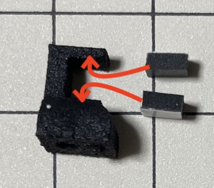

# ビルドガイド

## 資料構成

1. [紹介](#%E7%B4%B9%E4%BB%8B)
    1. [キット付属パーツ](#%E3%82%AD%E3%83%83%E3%83%88%E4%BB%98%E5%B1%9E%E3%83%91%E3%83%BC%E3%83%84)
    1. [キット外のパーツ](#%E3%82%AD%E3%83%83%E3%83%88%E5%A4%96%E3%81%AE%E3%83%91%E3%83%BC%E3%83%84)
    1. [組み立てに必要な工具など](#%E7%B5%84%E3%81%BF%E7%AB%8B%E3%81%A6%E3%81%AB%E5%BF%85%E8%A6%81%E3%81%AA%E5%B7%A5%E5%85%B7%E3%81%AA%E3%81%A9)
1. [ハードウェア作業](#%E3%83%8F%E3%83%BC%E3%83%89%E3%82%A6%E3%82%A7%E3%82%A2%E4%BD%9C%E6%A5%AD)
    1. [はんだ付け](#%E3%81%AF%E3%82%93%E3%81%A0%E4%BB%98%E3%81%91-5)
    1. [ケースの工作](#%E3%82%B1%E3%83%BC%E3%82%B9%E3%81%AE%E5%B7%A5%E4%BD%9C)
    1. [組み立て](#%E7%B5%84%E3%81%BF%E7%AB%8B%E3%81%A6)
1. [ソフトウェア作業](#%E3%82%BD%E3%83%95%E3%83%88%E3%82%A6%E3%82%A7%E3%82%A2%E4%BD%9C%E6%A5%AD)
    1. [$micon_normal_nn のファームウェアの書き込み](#pro-micro-%E3%81%AE%E3%83%95%E3%82%A1%E3%83%BC%E3%83%A0%E3%82%A6%E3%82%A7%E3%82%A2%E6%9B%B8%E3%81%8D%E8%BE%BC%E3%81%BF-by-remap)
1. [キーマップ設定作業](#%E3%82%AD%E3%83%BC%E3%83%9E%E3%83%83%E3%83%97%E8%A8%AD%E5%AE%9A%E4%BD%9C%E6%A5%AD)
    1. [キーマップの設定](#%E3%82%AD%E3%83%BC%E3%83%9E%E3%83%83%E3%83%97%E3%81%AE%E8%A8%AD%E5%AE%9A-by-remap)

## 変更履歴

* 2023-04-01 追加

 
 

<!------------ 紹介 ------------>

## 紹介

### キーボードの特徴

* 推しポイント
    * 40%キーボードです！
    * Aの段は `G`|`H` キーを中心に、CtrからEntまで対称になっています！
    * 使わなさそうですが 2u Backspace を搭載可能です！
    * 手前段のキーレイアウトを増やしました！
    * ポロンシートでPCB/SWプレートを支えてなんとなく柔らかいです！
* その他の特徴
    * 左Shiftはスプリット対応
    * BMPとボタン電池で無線接続可能

### 使用上の注意・FAQ

* 本キットは自作キーボードについての適切な知識をお持ちの方を対象としています
* 乱暴に扱うと支柱が壊れる恐れがあります (壊れたら替えを送ります)

### キット付属パーツ

以下のパーツはキットに付属します。

パーツをなくしてしまった場合は補修パーツの購入ページを設けますので、  
購入ショップかTwitterでご連絡ください。

| 筐体部品 | 数量 | | 電子部品 | 数量 |
|  :-  |  -:  |-|  :-  |  -:  |
| $ps1_nn | 8 | | $pcb_nn  | 1 |
| $ps2_nn | 5 | | $plate_sw_nn  | 1 |
| $nut_nn  | 13 | | $plate_btm_nn  | 1 |
| $scr_nn  | 29 | | $sw_socket_nn  | 48 |
| $poron_nn  | 21 | | $diode_nn  | 48 |
| $daughter_board_rivet_nn  | 4 | | $daughter_board_nn  | 1 |
| $rubber_foot_nn | 4 | | $jst_wire_nn  | 1 |
| $spacer1_nn  | 7 | | $usb_b_con_nn  | 1 |
| $scr_smallf_nn  | 7 | | $usb_c_con_nn  | 1 |
| $scr_smallb_nn  | 7 | | $reset_sw_nn  | 1 |
| $spacer2_nn  | 8 | | $jst_wire2_nn  | 1 |

※ 付属品の外観ならびに型番は [パーツリスト](../README_parts/README_${_lang}.md) を参照してください

### キット外のパーツ

以下はキーボードの動作のために必須ですが、メインキットは含まれていません。  
自作キーボードを扱うショップよりご購入ください。

| 品目 | 数量 |
|  :-  |  -:  |
| $micon_normal_nn  | 1 ※1 |
| $konsuru1_nn  | 1 ※1 |
| $switch_nn  | 最大 48 ※2 |
| $keycap_nn  | - |
| $stabi_nn  | 最大 4 ※3 |
| $stabi_long_nn  | 最大1 ※3 |
| USBケーブル (USB Type-C)  | 1 |

※1 Pro Microオプション付きの場合は不要です  
※2 キーレイアウトによります  
※3 スタビライザーの数もレイアウト次第で、また2Uであればスタビ無しでもなんとかなります

### 組み立てに必要な工具など

組み立て時に必須の工具とあったほうがよい工具(推奨)は以下のとおりです。

| 必須         | 数量 | | 推奨                 | 数量 |
|  :-          |  -:  |-|  :-                  |  -:  |
| パソコン     | 1    | | 作業マット (A4以上)  | 1 |
| ドライバー   | -    | | 逆作用ピンセット     | 1 |
| ニッパー     | 1    | | エポキシ接着剤       | 1 |
| はんだごて   | 1    | | 木工用ボンド         | 1 |
| はんだごて台 | 1 | | ペン(黒)         | 1 |
| はんだ       | - |
| マスキングテープ  | 1 |

 
 

<!------------ ハードウェア ------------>

## ハードウェア作業

### $micon_normal_nn の破損対策 (オプション)

$micon_normal_nn は USBケーブルの抜き差し中にマイコンボード側のコネクタの破損がまれによくあるそうなので、コネクタを補強します。  
最初の作業がオプションとなりますが、完了までにかかる時間のほとんどが放置時間ですので、先に済ませます。

1. エポキシ接着剤 で $micon_normal_nn のUSBコネクタの周囲を補強する

    

1. 放置し、次の作業をすすめる

 

### はんだ付け (全5工程)

大変な作業から順に並べています。
2つ目が終わるとほぼ終わっています。  

#### $diode_nn のはんだ付け (1/5)

1. 1つ目の $diode_nn を $pcb_nn にはんだ付けする
    * **注意事項** $plate_btm_nn のD91とD92 は $diode_nn と異なるダイオードで、ここでは取り付けません

        

    1. 部品を載せる前に、2つある■( `[■ ▷| ■]` )の片側に予備はんだを盛る  
       ※ はんだごてを持つ手側の■に盛るとよいです  

       
    1. $diode_nn の片足を予備はんだと接合する  
       ※ ダイオードに印字されている `|` と`[■ ▷| ■]` の `▷|` を合わせてください  

       
    1. $diode_nn が基板から浮いていないことを確認する  

       
    1. $diode_nn の未接合の足をはんだ付けする

       
    1. $diode_nn が基板から浮いていないことを確認する

1. 残る47個の $diode_nn を $pcb_nn にはんだ付けする
    1. 部品を載せる前に、2つあるスペースの片側に予備はんだを盛る
    1. $diode_nn の片足を予備はんだと接合する
    1. $diode_nn が基板から浮いていないことを確認する
    1. $diode_nn の未接合の足をはんだ付けする
    1. $diode_nn が基板から浮いていないことを確認する

#### $sw_socket_nn のはんだ付け (2/5)

手前の $sw_socket_nn は、キー幅変更の都合でほぼ同じ位置の上下に $sw_socket_nn を装着可能としている箇所がいくつかあります。  
意図しない箇所に $sw_socket_nn を装着すると、修正の手数が増え、かつ部品が不足します。  
キー幅と装着箇所は以下のように複雑になってしまっているため、先に装着箇所を決定し、マークしてください。

1. 1つ目の $sw_socket_nn を基板にはんだ付けする
    1. 部品を載せる前に、2つあるスペースの片側に予備はんだを盛る

       
    1. $sw_socket_nn の片足を予備はんだと接合する

       
    1. $sw_socket_nn が基板から浮いていないことを確認する

       
    1. $sw_socket_nn の未接合の足をはんだ付けする

       
    1. $sw_socket_nn が基板から浮いていないことを確認する

1. 残る47個の $sw_socket_nn を基板にはんだ付けする
    1. 部品を載せる前に、2つあるスペースの片側に予備はんだを盛る
    1. $sw_socket_nn の片足を予備はんだと接合する
    1. $sw_socket_nn が基板から浮いていないことを確認する
    1. $sw_socket_nn の未接合の足をはんだ付けする
    1. $sw_socket_nn が基板から浮いていないことを確認する

#### $reset_sw_nn のはんだ付け (3/5)

1. $reset_sw_nn を $pcb_nn にはんだ付けする
    1. $reset_sw_nn を $pcb_nn に取り付ける  
       ※ $reset_sw_nn を取り付ける面は ダイオード と同じです

        
    1. $reset_sw_nn が $pcb_nn から浮いていないことを確認する
    1. $reset_sw_nn をはんだ付けする

#### ワイヤー のはんだ付け (4/5)

(キーボードの利用シーンを仮にPCとしています)  
PCとキーボードの接続にて、PC と キーボードの $micon_normal_nn をUSBケーブルで直接接続するわけではありません。  
`[PC]--[USB Type-Cケーブル]--[$daughter_board_nn]--[$jst_wire_nn]--[$micon_normal_nn]` という物理的な接続となります (以下は取り出した写真) 。

このとき、[$micon_normal_nn]と接続する[$jst_wire_nn]にUSBオスコネクタが取り付けられていませんので、  
使用する $micon_normal_nn に合わせたコネクタ と USBオスコネクタ をはんだ付けします。

1. $usb_b_con_nn と $jst_wire_nn をはんだ付けする場合
    1. $usb_b_con_nn に予備はんだを盛る

        
    1. 画像のとおりにはんだ付けする

        

        
1. $usb_c_con_nn と $jst_wire_nn をはんだ付けする場合
    1. $usb_c_con_nn に予備はんだを盛る
    1. 画像のとおりにはんだ付けする

          

        

なお、はんだ付けしたワイヤーの芯線同士が接触しないように エポキシ接着剤 などで固定しておくとよいです。

#### $konsuru1_nn と $micon_normal_nn のはんだ付け (5/5)

1. 説明
    1. $konsuru1_nn は ピンヘッダ/ピンソケットを使う場合より マイコンボード を PCBから抜き差ししやすくするパーツですが、$konsuru1_nn と $micon_normal_nn をはんだ付けする必要があります

    1. $konsuru1_nn と $micon_normal_nn の接続は、下図のようになります

       
    1. $micon_normal_nn と $pcb_nn の接続は、下図のように VCC / RST / GND と $micon_normal_nn の VCC / RST / GND を一致させます

       
1. 1本目の $konsuru1_nn を $micon_normal_nn にはんだ付けする
    1. $konsuru1_nn の端の1pinをはんだ付けする
    1. $konsuru1_nn が $micon_normal_nn から浮いていないことを確認する
    1. $konsuru1_nn の反対端の1pinをはんだ付けする
    1. $konsuru1_nn が $micon_normal_nn から浮いていないことを確認する
    1. $konsuru1_nn の残りのpinをはんだ付けする

1. 2本目の $konsuru1_nn を $micon_normal_nn にはんだ付けする
    1. $konsuru1_nn の端の1pinをはんだ付けする
    1. $konsuru1_nn が $micon_normal_nn から浮いていないことを確認する
    1. $konsuru1_nn の反対端の1pinをはんだ付けする
    1. $konsuru1_nn が $micon_normal_nn から浮いていないことを確認する
    1. $konsuru1_nn の残りのpinをはんだ付けする

#### 番外：BMP用電源パーツ のはんだ付け (別資料)

$micon_normal_nn の代わりに $micon_bmp_nn を使用する場合は [BMP](../README_bmp/README_${_lang}.md#%E3%81%AF%E3%82%93%E3%81%A0%E4%BB%98%E3%81%91-4) を参照してください。

 

### 支柱の準備

1. $ps1_nn に $poron_nn を 2枚 貼り付ける

    
1. $ps2_nn に $poron_nn を 1枚 貼り付ける

    
1. 支柱に $nut_nn を取り付ける

    

 

### $plate_btm_nn の準備

1. $plate_btm_nn を切り離す
    * $plate_btm_main_nn / $plate_btm_tilt_nn / $plate_btm_hokyo_nn に分割

    
1. $plate_btm_main_nn / $plate_btm_tilt_nn / $plate_btm_hokyo_nn のバリをやすりで削る

1. $plate_btm_main_nn / $plate_btm_tilt_nn / $plate_btm_hokyo_nn の側面を着色する  
   ※ これは Holts MH6707 で着色しましたが、触ったとき色落ちしにくくよいと思います

    
1. (オプション) $plate_btm_main_nn に $plate_btm_hokyo_nn を取り付ける  
   ※ ボトムプレートのたわみが気になる場合、キットに含めていませんが、M2ナットと5mm低頭ネジで $plate_btm_main_nn と $plate_btm_hokyo_nn を4箇所固定してください

    

 

### 組み立て

1. $stabi_nn を $pcb_nn に取り付ける

1. $pcb_nn に $scr_smallb_nn と $spacer1_nn を 7箇所に取り付ける  
   ※ $scr_smallb_nn は頭が丸いネジです

    
1. $pcb_nn と $plate_sw_nn を $scr_smallf_nn で合体する  
   ※ $scr_smallf_nn は頭が平たく短いネジで、完成後に目立ちにくくなります

    
1. $switch_nn を $plate_sw_nn に取り付ける  
   ※ $pcb_nn を裏から抑えながらスイッチを取り付けると、はんだづけ箇所の破損を防ぐ効果があります  
   ※ スイッチの前後向きや、左右位置に気をつけてください

1. $micon_normal_nn を $pcb_nn に取り付ける  
   ※ $micon_normal_nn を使う場合は `BAT-` や `BAT+` のpinを空けて取り付けます

    
1. $ps1_nn と $ps2_nn を $scr_nn で $plate_btm_main_nn に取り付ける  
   ※ メンテナンスのときもこの箇所のネジは接続したまま開けられます

    
1. $spacer2_nn を $scr_nn で $plate_btm_main_nn に取り付ける  

    
1. $daughter_board_nn を $daughter_board_rivet_nn で $plate_btm_main_nn の奥側に取り付ける  
   ※ 写真のように2箇所でも十分です

    
1. $jst_wire_nn を接続する

    
1. $pcb_nn を $plate_btm_main_nn に載せます  
   ※ 見やすくするために $pcb_nn と $plate_sw_nn を合体させていない写真です

    
1. $pcb_nn を挟み込むように $ps1_nn を $plate_btm_main_nn に取り付け、 $scr_nn で固定します  
   ※ 見やすくするために $pcb_nn と $plate_sw_nn を合体させていない写真です

    
1. $plate_btm_main_nn に $plate_btm_tilt_nn を $scr_nn で固定します

    
1. $plate_btm_tilt_nn に $rubber_foot_nn を貼り付ける (終)

    

### ハードウェア作業の終わり

以上で見た目がキーボードとなりました。  
キーボードとして使うためには $micon_normal_nn に適切なファームウェアが書き込まれている必要があります。  
次のソフトウェアの作業を実施してください。

 
 

<!------------ ソフトウェア ------------>

## ソフトウェア作業

### $micon_normal_nn のファームウェア書き込み (by Remap)

※$micon_normal_nn の代わりに $micon_bmp_nn を使用する場合は [BMP](../README_bmp/README_${_lang}.md#%E3%82%BD%E3%83%95%E3%83%88%E3%82%A6%E3%82%A7%E3%82%A2%E4%BD%9C%E6%A5%AD) を参照してください。

1. USBケーブル でPCに接続する
1. Remapにて、ファームウェアファイルを $micon_normal_nn に書き込む
    1. [こちら](https://remap-keys.app/catalog/3rpQkcurHny6IPkoYaSW/firmware)に Google Chrome でアクセスする
    1. [FLASH] を押下する

        
    1. [Bootloader] に [caterina] を選択し、もう一度[FLASH]を押下する

        
    1. 「remap-keys.app がシリアルポートへの接続を要求しています」と表示されたら、$pcb_nn の $reset_sw_nn を押す

        
    1. $micon_normal_nn のLEBが赤く点灯したら、即座に[Arduino Micro]を選択し、即座に[接続]を押下する

        
    1. 進捗が100%となり、「Writing the firmware finished successfully.」と表示されたら[CLOSE]を押下する

        

### ソフトウェア作業の終わり

以上で $micon_normal_nn にファームウェアが書き込まれ、すでにキーボードとして認識された反応が PC で発生したものと思います。  
現在のキーボードでは以下のように数字を入力できないなど不便な状態となっています。

次のキーマップ設定作業を実施してください。

 
 

<!------------ キーマップ ------------>

## キーマップ設定作業

### キーマップの設定 (by Remap)

1. Remapにて、キーマップ設定を変更する
    1. [こちら](https://remap-keys.app)に Google Chrome でアクセスする

    1. [START REMAP FOR YOUR KEYBOARD] を押下する

        
    1. [+KEYBOARD] を押下する

        
    1. 「remap-keys.app が HID デバイスへの接続を要求しています」と表示されたら[bbl46] を選択し、[接続]を押下する  
       ※ $micon_normal_nn の場合は「 $kbname 」を、$micon_bmp_nn の場合は「 (BMP)$kbname 」を選択してください

        
    1. お好みのキーマップを作成し、 [flash] を押下する

        

### キーマップの設定終わり

以上でキーマップ設定が終わり、キーボードとして完成しました。  
お疲れ様でした。

 
 

# さいごに

自作キーボードのHW/SW設計構築の普及を進めてくださっている先人に感謝申し上げます。  
また、 $kbname に興味を持ってくださいまして、ありがとうございます。
