# パーツ

## 筐体部品

### 支柱 (長)

型番: なし

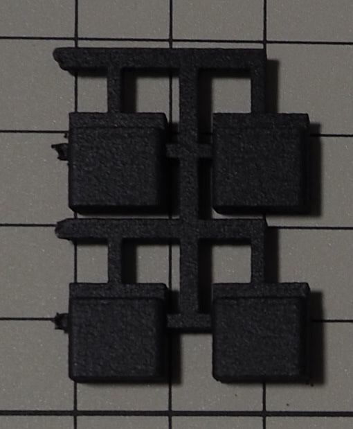

### 支柱 (短)

型番: なし

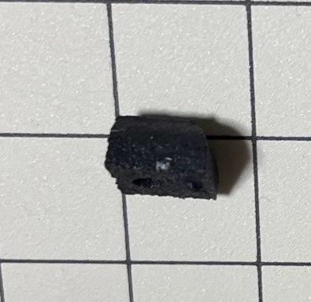

### ナット (M2/1.6mm)

型番: FNT-02EB

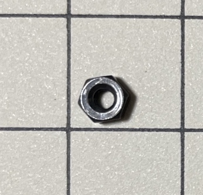

### 小ねじ (M2/4mm)

部品番号: a19111100ux0321jp  
ASIN: 	B083DQSSNR

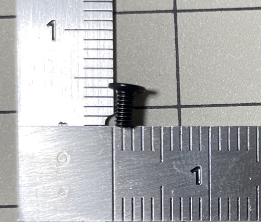

### ポロンシート

型番: L32-1.550MT (4mmx3mmカット)

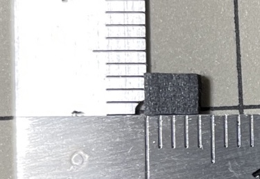

### プッシュリベット

型番: 不明  
ASIN: B071KNKNM5

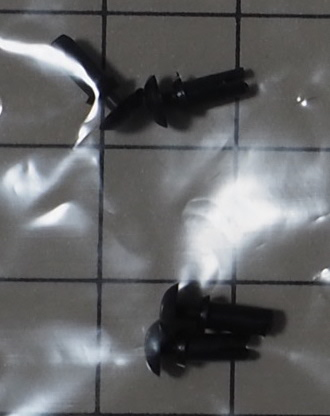

### ゴム足

型番: CS-01  
ASIN: B00V5MQQ5A

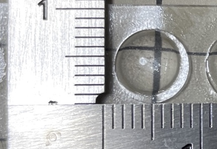

### 丸スペーサー (3.5mm) + 小ねじ (M2)

型番: 不明  
品名: KBDFANS M2-3 COUNTERSUNK FLAT HEAD SCREW KIT

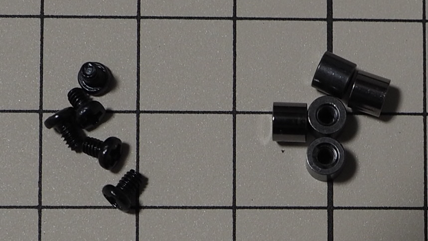

### 精密低頭小ねじ (M2)

型番: FX-0230EB

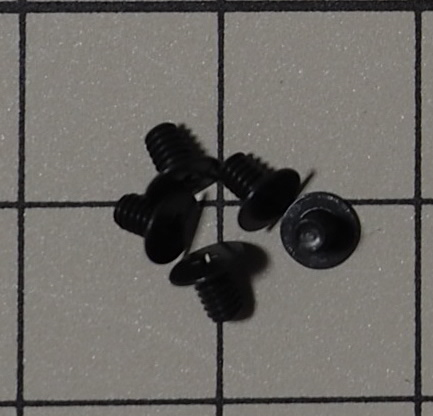

### 六角スペーサー (5mm)

型番: 不明  
品名: 黄銅スペーサー (六角) M2 5mm

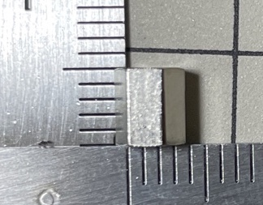

 

## 電子部品

### PCB

型番: なし

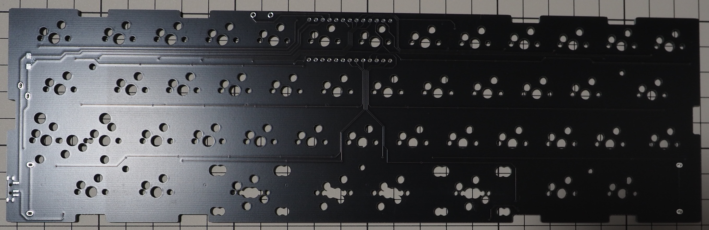

### スイッチプレート

型番: なし

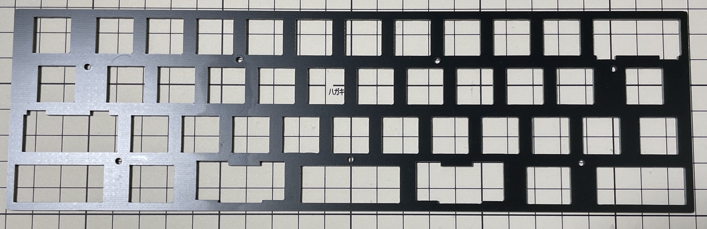

### ボトムプレート

型番: なし

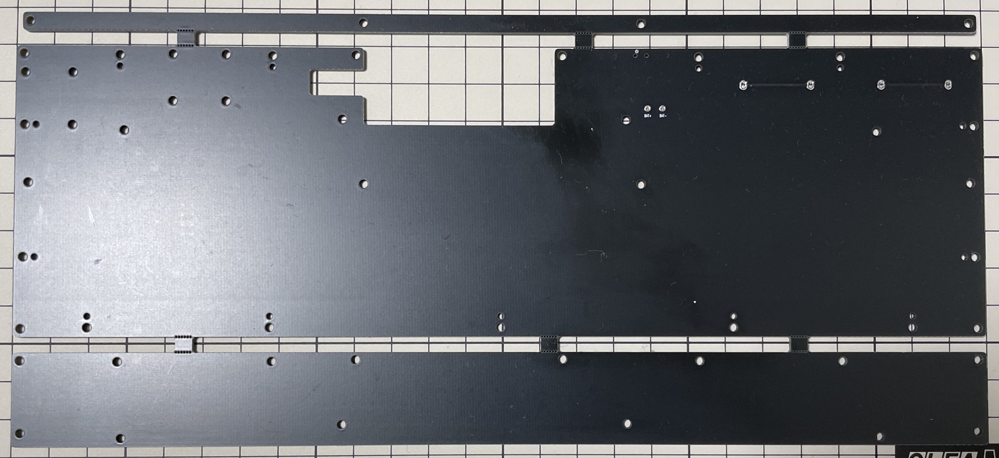

### MX互換スイッチソケット

型番: CPG151101S11

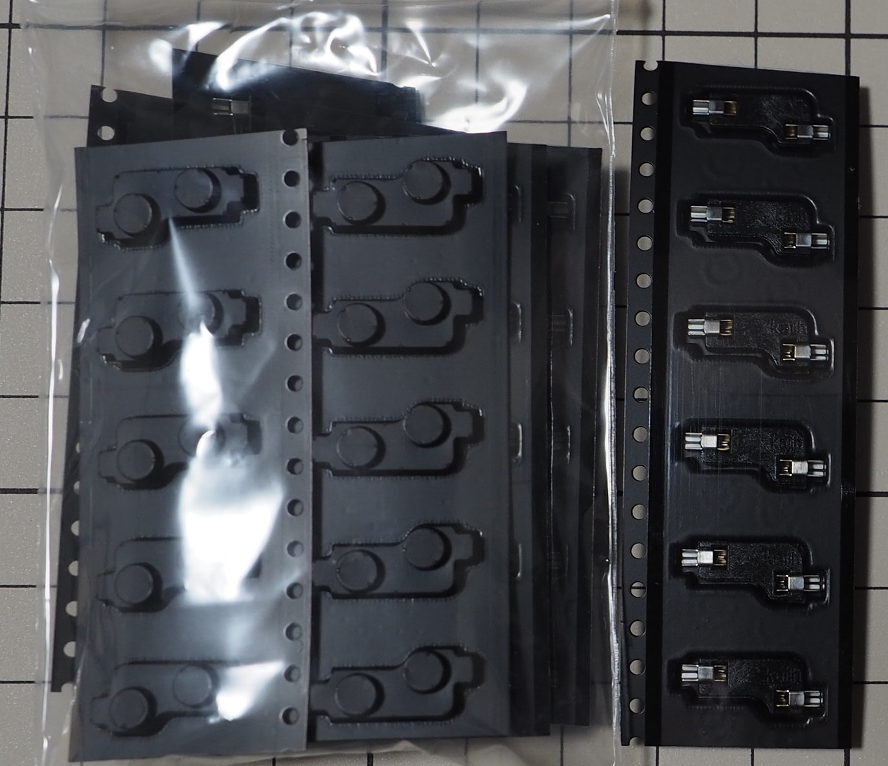

### ダイオード (SMDタイプ)

型番: 1N4148

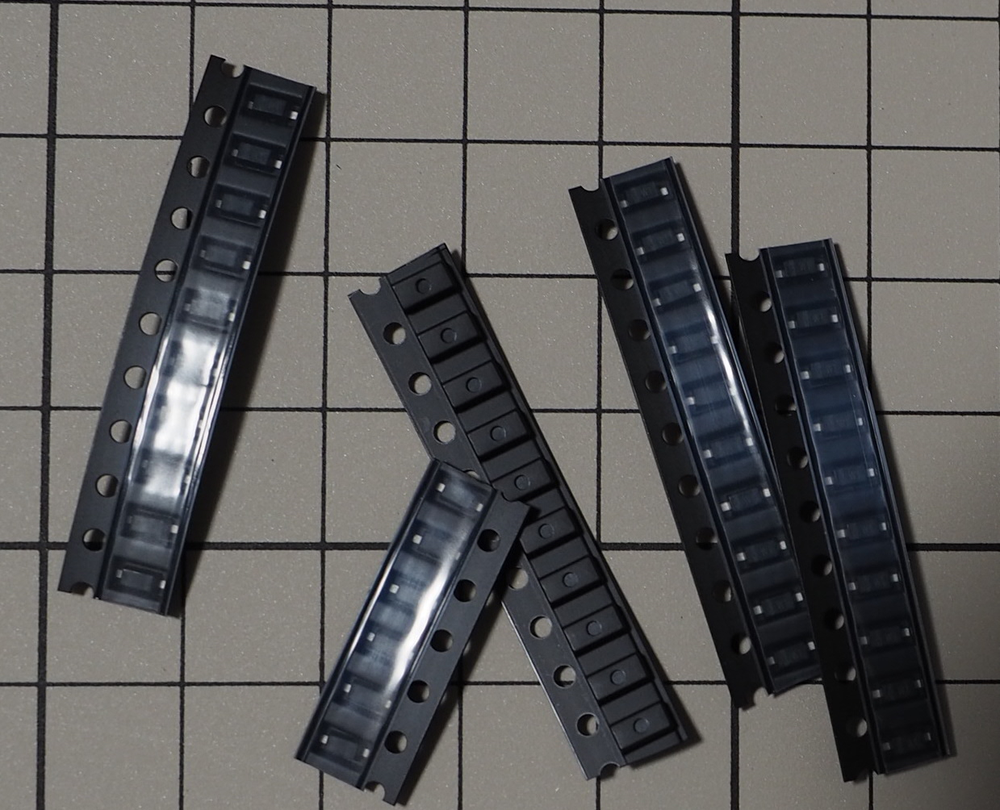

### ドーターボード

型番: なし  
品名: Unified Daughterboard C3

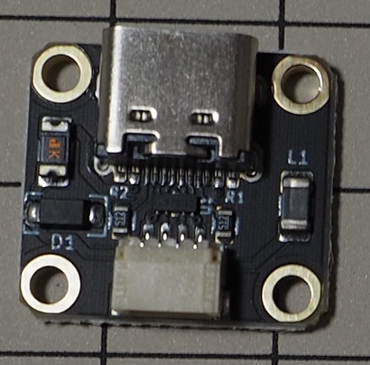

### JST SH型 4ピンコネクタ付きジャンパワイヤ

型番: AF-EMGSH4F010

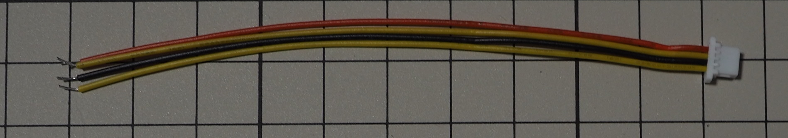

### Micro USB Type-B（2.0）端子

型番: 不明  
ASIN: B07JGYSFYP

### USB Type-C端子

型番: 不明  
ASIN: B0B3HSXR9F

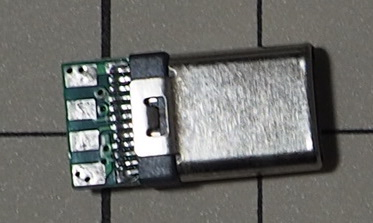

### RST用タクタイルスイッチ

型番: TS-1136-4.3

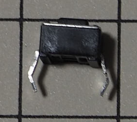

### JST 1.25mm 2ピン ペアコネクタ付きワイヤ

※BMP無線使用時の電源ケーブル

型番: 不明  
ASIN: B07NRR255D

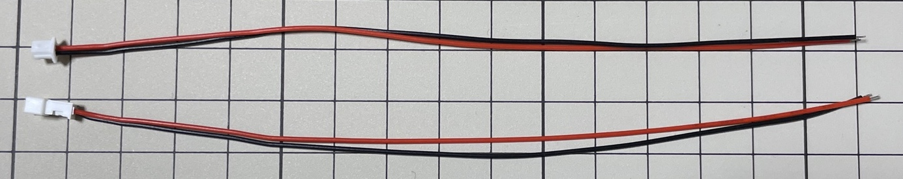

