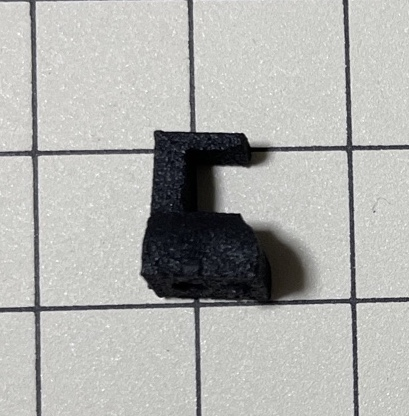
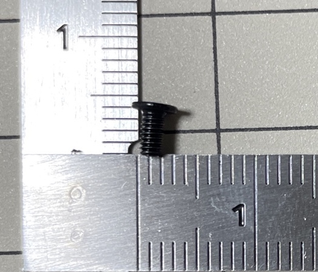
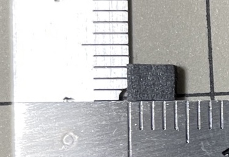
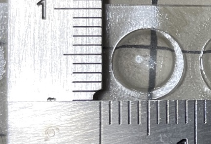
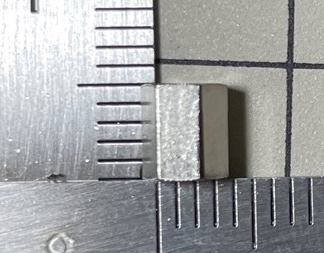
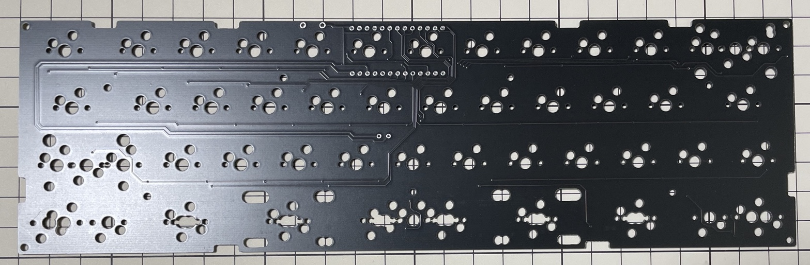
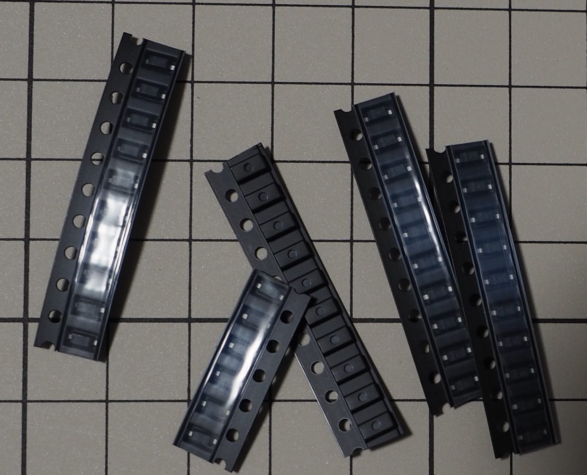
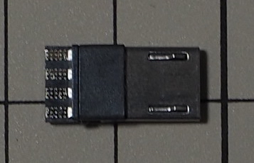

# パーツ

## 筐体部品

### $ps1_nn

型番: なし

### $ps2_nn

型番: なし

### $nut_nn

型番: FNT-02EB

### $scr_nn

部品番号: a19111100ux0321jp  
ASIN: 	B083DQSSNR

### $poron_nn

型番: L32-1.550MT (4mmx3mmカット)

### $daughter_board_rivet_nn

型番: 不明  
ASIN: B071KNKNM5

### $rubber_foot_nn

型番: CS-01  
ASIN: B00V5MQQ5A

### $spacer1_nn + $scr_smallb_nn

型番: 不明  
品名: KBDFANS M2-3 COUNTERSUNK FLAT HEAD SCREW KIT

### $scr_smallf_nn

型番: FX-0230EB

### $spacer2_nn

型番: 不明  
品名: 黄銅スペーサー (六角) M2 5mm

 

## 電子部品

### $pcb_nn

型番: なし

### $plate_sw_nn

型番: なし

### $plate_btm_nn

型番: なし

### $sw_socket_nn

型番: CPG151101S11

### $diode_nn

型番: 1N4148

### $daughter_board_nn

型番: なし  
品名: Unified Daughterboard C3

### $jst_wire_nn

型番: AF-EMGSH4F010

### $usb_b_con_nn

型番: 不明  
ASIN: B07JGYSFYP

### $usb_c_con_nn

型番: 不明  
ASIN: B0B3HSXR9F

### $reset_sw_nn

型番: TS-1136-4.3

### $jst_wire2_nn

※BMP無線使用時の電源ケーブル

型番: 不明  
ASIN: B07NRR255D

